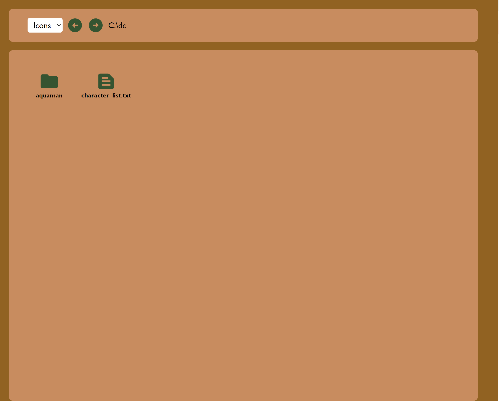

# edument-code-test-frontend

A try to complete a code test given to me by Edument. The goal of the assignent was to create a file system that can display folders and files, and inside folders you should be able to create new folders and files.

The assignement is purely frontend written in react and typescript. The bundling is taken care of vite, not webpack.

Functionality that is available in the application:

### Change view style.
The dropdown in the upper right corner gives you to display options. As icons or as a list.

### Filapath
Next to the dropdown in the upper right corner is the filepath. The filepath is updating depending on which folder you're currently in. 
