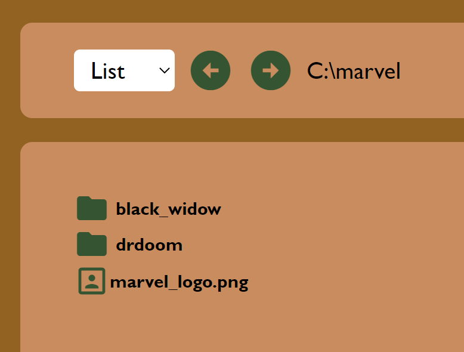

# File System written in react and typescript

A try to complete a code test given to me by Edument. The goal of the assignment was to create a file system that can display folders and files, and inside folders you should be able to create new folders and files.

The assignement is purely frontend, written in react and typescript. The bundling is taken care of vite instead of webpack.

To run the application, simply clone the repository, go to the root file of the application and run a _npm install_ and then a _npm run dev_ and the application will run on localhost 3000.

Functionality that is available in the application:

### Change view style:
The dropdown in the upper right corner gives you to display options. As icons or as a list.

### Filepath:
Next to the dropdown in the upper right corner is the filepath. The filepath is updating depending on which folder you're currently in. The arrows between the dropwdown and filepath is the history navigator. You can move back and forth in your browsing history.

### Create new folders and files:
By right clicking somewhere inside the application (not on a folder or file), a context menu will be shown that gives you two choices. Create a new file or a new folder. By clicking on ons of those a ned folder or a new file will be created in the folder you are currently in.

### Remove and rename folders and file:
By right clicking on a folder and file you will se a context menu with two other options. To remove or rename. By clicking on rename the text underneath the folder or file will be changed to an input and you can type in your new name there. By clicking on remove the folder or file will simply be removed.

